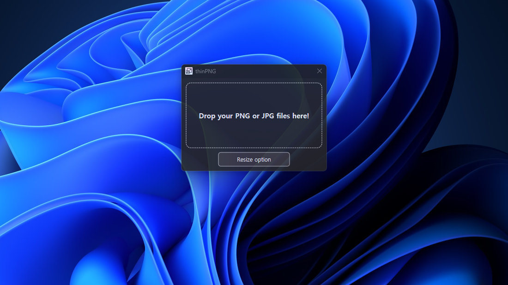
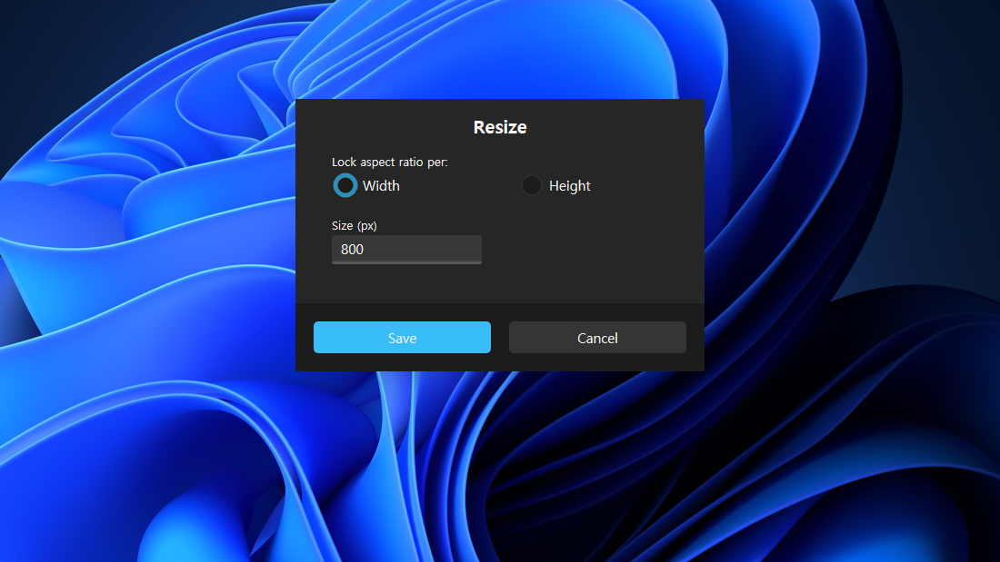
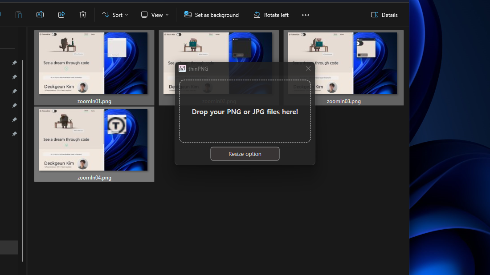
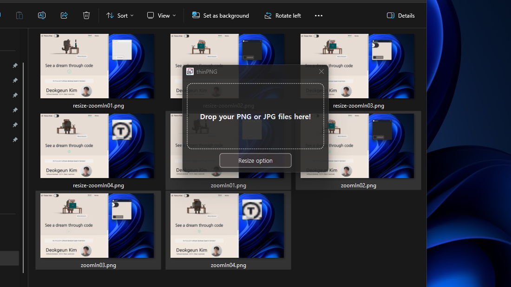
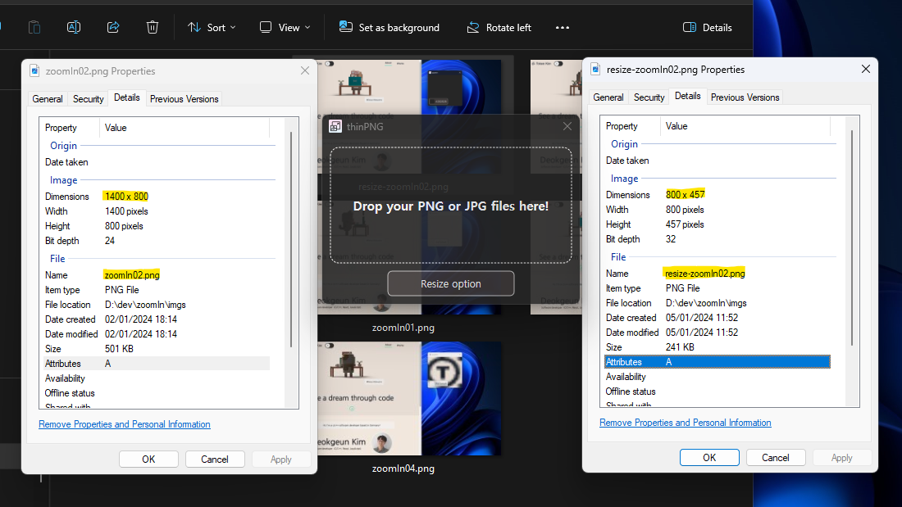

# thinPNG

A project with C++ to resize pictures. This project is implemented to use myself when using pictures in a web application. Because sometimes a low pixel picture is better in web applications for optimization.

---

The first update version of thinPNG.exe which was implemented with the MFC library.

In this version the AppTemplate library is used instead of the MFC library.

The AppTemplate is a library to make Windows Desktop Application easier by using Direct2D Rendering and Win32-API.

## How to install

Even if there is no virus, man can't download the executable file on website, so you must download the project and build as `x86` it yourself.
Clone this project and execute the `thinPNG.sln` file with Visual Studio and just build.

## How to use

Just drag and drop image files. PNG, JPEG, JPG format is possible.
A directory can't be used yet.

## Used tools

- C++
- Win32 API (especially Direct2d)
- Visual Studio

## Overview

  
  
  
  
  
